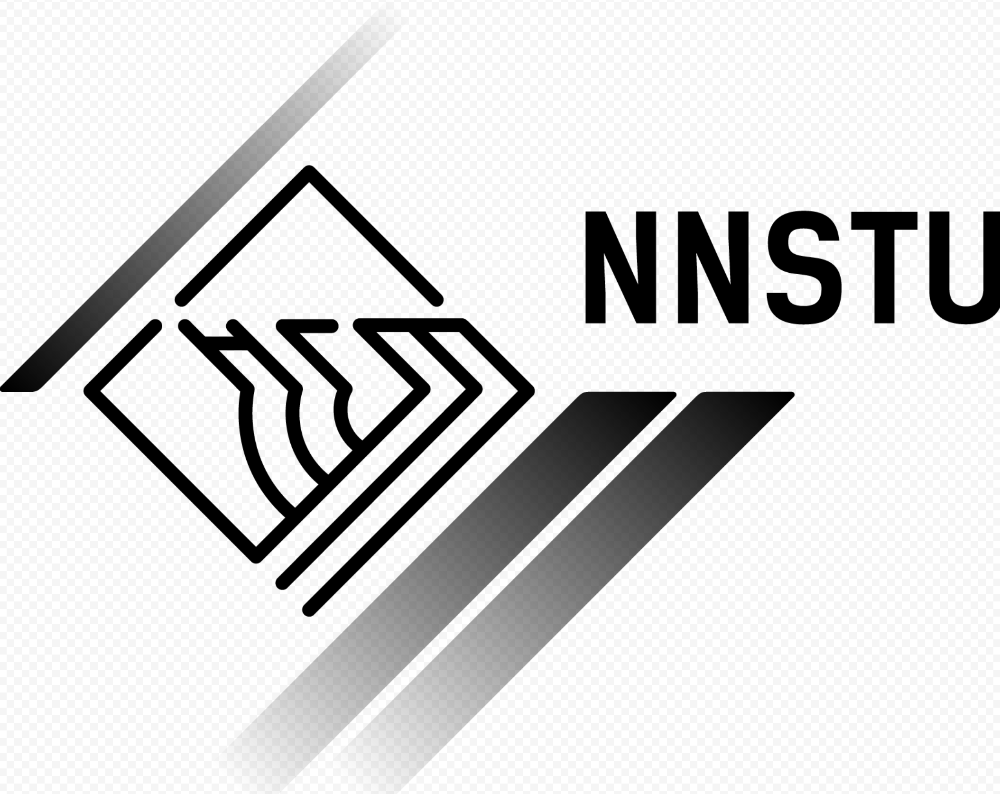
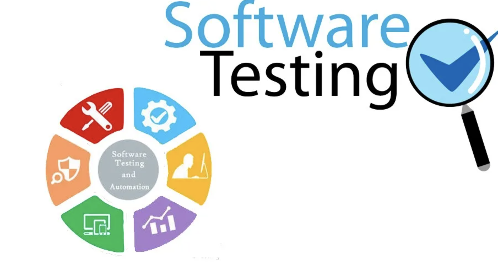

   <h1>
      Hello!:smiley:
   </h1>

- Contacts:

  &#8287;&#8287;&#8287;&#8287;&#8287;
  
  &#8287;

<!--Stack and tools-->

&#8287;&#8287;&#8287;&#8287;&#8287;

## :briefcase: Technologies

  <code></code>
  <code></code>
  <code></code>
  <code></code>
  <code></code>
  <code></code>
  <code></code>
  <code></code>
  <code></code>
  <code></code>
  <code></code>
  <code></code>
  <code></code>
  <code></code>
  <code></code>
  <code></code>
  <code></code>
  <code></code>
  <code></code>
  <code></code>
  <code></code>

<!--Projects-->

## :floppy_disk:Projects

### [UI autotests](https://github.com/mkdv00/ui_demoqa) 

### [API autotests](https://github.com/dmitri91/qa_guru_demo_webshop) 

### [Mobile autotests](https://github.com/dmitri91/qa_guru_demo_webshop) 

<!--Education-->

## :man_student:Education

<table width="100%" border='0'>
   <tr>
    <td width="30%" valign="bottom"></td><td valign="middle">Nizhny Novgorod State Technical University. Direction - thermal power engineering.</td></tr>
  </table>
   

#### Additional Education:

<table width="100%" border='0'>
   <tr><td width="20%" valign="bottom"></td><td valign="middle"> <a target="_blank" href="https://www.software-testing.ru/edu/3-online/242-selenium-webdriver/">Selenium WebDriver: полное руководство</a>.</td></tr>

   <tr><td width="30%" valign="bottom"></td><td valign="middle"> <a target="_blank" href="https://www.learnqa.ru/python_api">Автоматизация тестирования REST API на Python</a>.</td></tr>
   </tr>

   <tr><td width="30%" valign="bottom"></td><td valign="middle"> <a target="_blank" href="https://skyeng.ru/">Skyeng</a>.</td></tr>

   <tr><td width="30%" valign="bottom"></td><td valign="middle">School of Test Automation Engineers <a target="_blank" href="https://qa.guru">qa.guru</a>.</td></tr>
   </tr>
  </table>
